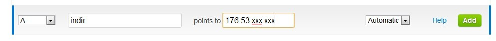

Merhaba Arkadaşlar

Cloudflare bildiğiniz üzere bulut sunucu.Sitemizi Cloudflare sunucularına geçirdiğimizde birçok faydasını görüyoruz.Ancak bu seferde subdomain açarken zorlanıyoruz.Şimdi size nasıl subdomain açacağınızı göstereyim…

Mesala indir.teklif.me adlı bir subdomain açacaksınız.Bunun için öncelikle cloudflare panelizden dns ayarlarına girin.Orada name kısmına sadece subdomain adınızı girin sonuna uzantı eklemeyin.Daha sonra value kısmına hostunuzun ip adresini yazın.TTL Kısmını otomatik yapın ve kayıt şeklini A olarak seçip kaydedin.Biraz bekledikten sonra subdomainiz hazırdır.

Örnek resim:

Hayırlı Günler
