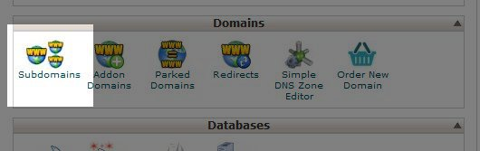
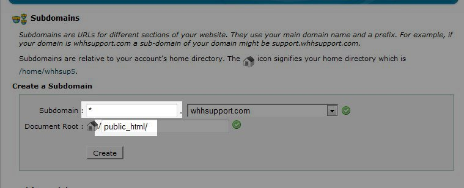

Merhaba

Bügün Size Nasıl Wildcard Subdomain(Alt Alan Adı) Açmayı Anlatmaya Çalışacam.Öncelikle bu nerede lazım olur… Multi forum ve multi blog dağıtan sitelerde size lazım olur.Şimdi Uzatmadan Konuya Geçelim.

 

Öncelikle Şöyle Cpanelinizi açın ve daha sonra resimdeki yolu izleyin.

 

Subdomain bölümüne girdikten alttaki resimde görülen subdomain bölümüne \* işaretini koyun.Belge kök alanınıda public\_html veya www klasörü olarak gösterin.

 

 

Daha sonra kaydedin.Wildcard Subdomaininizi hayırlı olsun.
