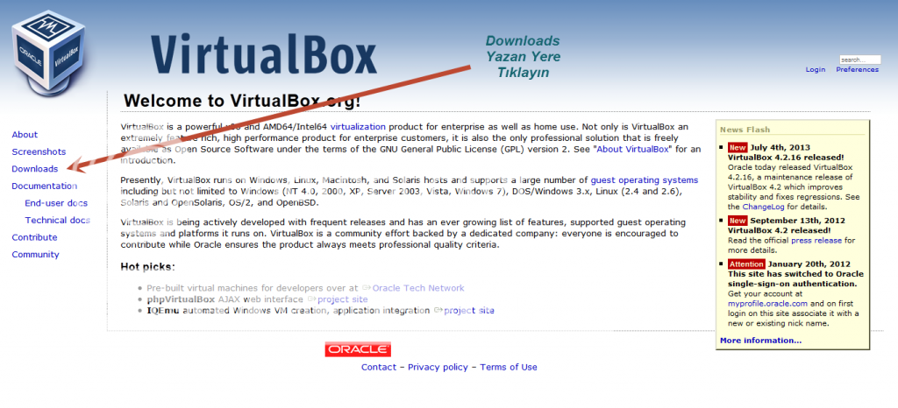
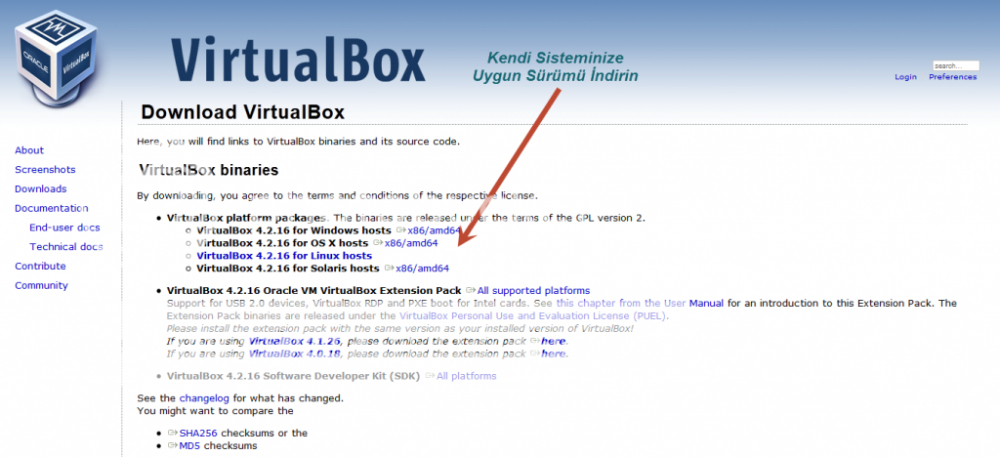
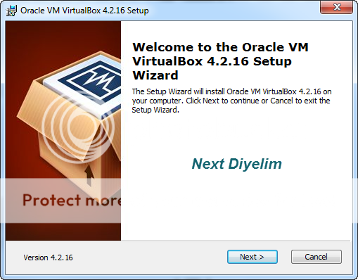
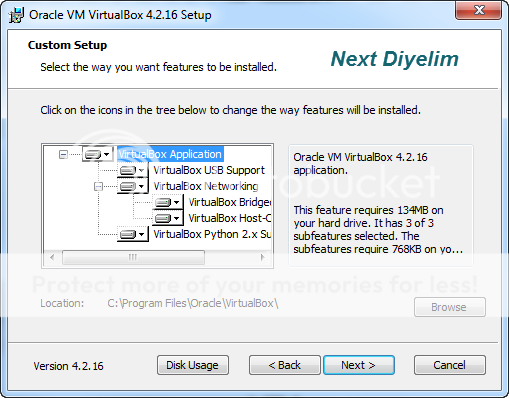
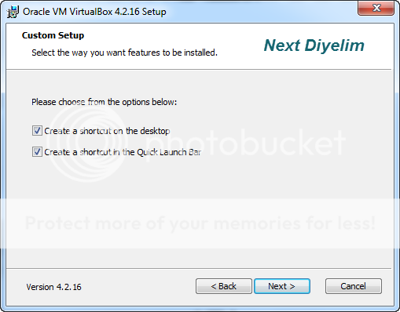
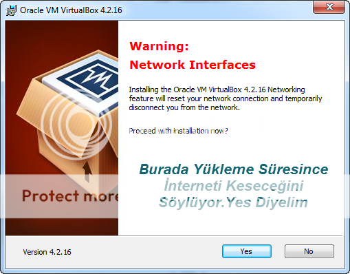
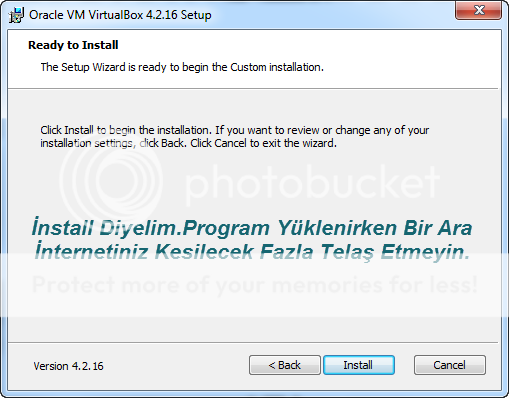
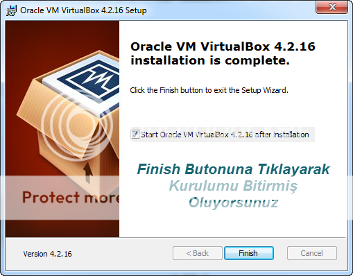
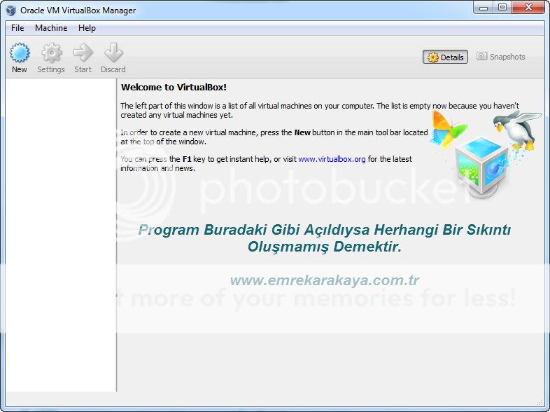

Merhaba Arkadaşlar

Boşa geçen zamanlarının değerlenmesi amacıyla artık bazı yazılar hazırlayacam.Bu amaçla ilk olarak Virtual Box programınını anlatmaya çalışacağım.Neyse arkadaşlar lafı fazla uzatmadan derse başlıyalım

### Öncelikle Virtual Box Nedir?

**VirtualBox** bilgisayarınızda sanal işletim sistemleri kurmanızı sağlayan **açık kaynak kodlu ücretsiz** bir yazılımdır. **Windows, Linux, Macintosh ve OpenSolaris** gibi işletim sistemleri dışında tanınmış ücretsiz işletim sistemlerinde de sorunsuz şekilde çalışan VirtualBox, sürekli geliştirilerek özellikleri artan bir yazılımdır.

### Virtualbox Kurulumu Nasıl Yapılır??

Öncelikle [https://www.virtualbox.org/](https://www.virtualbox.org/ "ad") adresine giriş yapın.Gerisini Resimler Size Anlatacaktır.

 

## İndirdiğiniz Dosyayı Açın...

 

Gördüğünüz üzere Virtual Box kurulumu çok basittir.Sorunuz Olursa Buradan Sorabilirsiniz.

Hayırlı Günler
