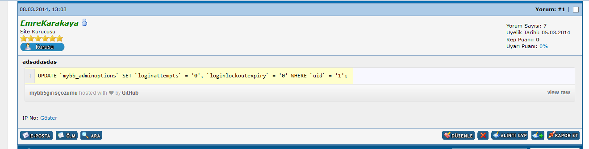

MyBB için Gist Eklentisi  Eklenti ismi: Mybb Gist Eklentisi  Eklenti Yapımcısı: Emre Karakaya  Eklenti Güvenlimi ?: Güvenli   Eklenti Versiyonu: 1.0  Test Durumu: Denemiştir-sorunsuz   Uyumlu Olduğu Sürüm-(ler): MyBB - 1.6.x  Eklenti Açıklaması:

Bu eklenti ile Mybb'ye mykod yöntemi ile Gist kodları eklenebilecektir.Örnek olarak eklemek istediğiniz Gist adresi :

 

`https://gist.github.com/EmreKarakaya/822963`

0 olsun.Burada forumunuza aşağıdaki şekilde ekleyebilirsiniz.

`[gist]https://gist.github.com/EmreKarakaya/8229630[/gist]`

 Eklenti Kurulumu: Kurulumu çok basittir.Github.php dosyanızı inc/plugins/ klasörüne atmanız ve eklentiyi aktifleştirmeniz gerekmektedir. Eklenti bundan sonrasını kendisi halledecektir.  Ekran Görüntüsü: 

**Github**

`https://github.com/EmreKarakaya/Mybb-Gist-Eklentisi`

**Bitbucket**

`https://bitbucket.org/EmreKarakaya/mybb-gist-eklentisi/`

**SourceForge**

`https://sourceforge.net/projects/mybbgisteklentisi/`

**Codeplex**

`https://mybbgist.codeplex.com` Eklentide aldığınız sorunları burada bildirseniz çözümleri daha hızlı üretebilirim.Hayırlı Günler Dilerim
