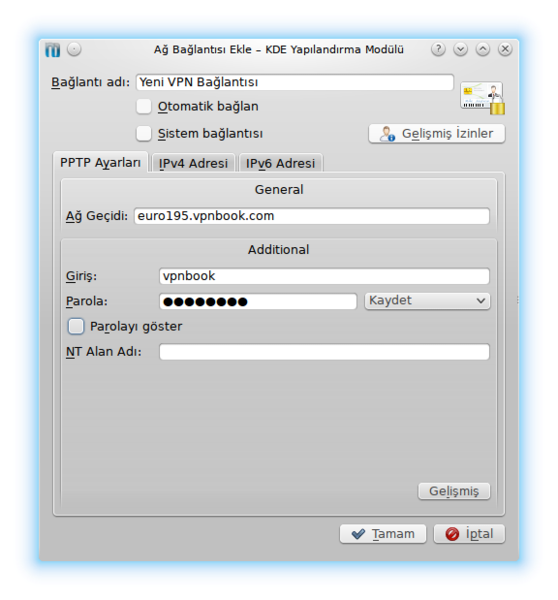

Merhaba Arkadaşlar

Bügün size nasıl Pisi Linux da PPTP VPN bağlantısı kurulacağını göstereceğim.Lütfen aşağıdaki anlatımı dikkatle takip ediniz.Eğer Vpn bağlantınızı kurmuş ancak bağlantıda hata alıyorsanız 5. adımı uygulayınız.

 

1. Ağ arayüzünde Bağlantıları yönet bölümüne tıklayınız
2. Karşınıza açılan pencerede sırasıyla Ağ Bağlantıları - VPN'yi seçiniz. Örnek resim aşağıda eklenmiştir.
3. Ekle Butonuna tıklayınız.Çıkan menüde PPTP bölümünü seçiniz.
4. Çıkan menüde kullanacağınız VPN'nin Ağ geçidi adresi giriş bölümüne kullanıcı adını parola kısmına ise Vpn parolanızı giriniz.
5. Bilgileri doğru bir şekilde girdikten sonra Gelişmiş bölümüne tıklayın.Burada **MPPE Şifrelemesi Kullan** bölümünü seçiyoruz.Eğer bu bölümü seçmeden kayıt edersek Vpn bağlatıda hata alacaksınız.
6. Yukarıda yazan adımları uyguladıktan sonra Tamam butonuna basarak Vpn'yi kayıt ediyoruz ve Vpn'yi kullanmaya başlıyoruz.

Vpn bağlantınızı ekledikten sonra Ağ arayüzü - Sanal Özel Ağ bölümüne gelerek sağ taraftan bağlanacağınız VPN'yi seçebilirsiniz.

Hayırlı Günler Dilerim
