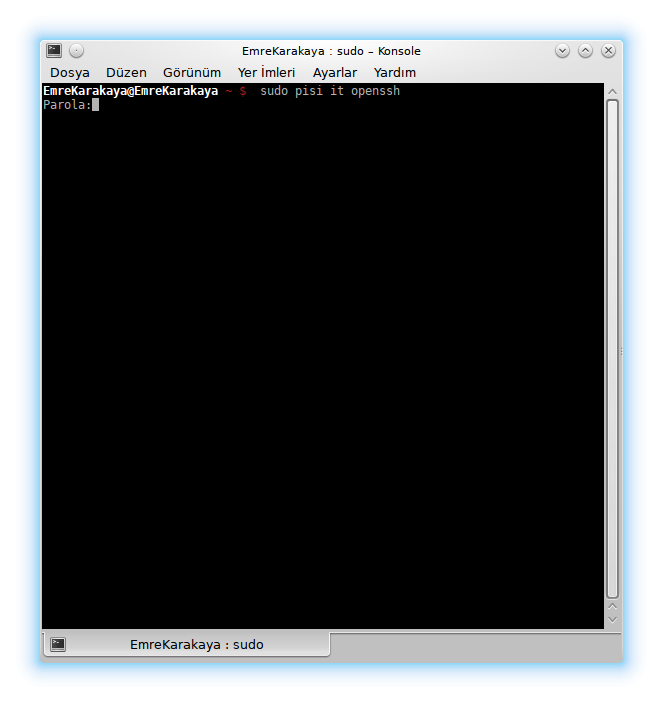

Merhaba Arkadaşlar

Bügün size yeni geçtiğim Pisi Linux işletim sisteminde nasıl **Ssh sunucu** bağlantısı yapılacağını göstermeye çalışacağım.Bu bağlantıyı yaparken kullanacağımız komutlar root izni gerektireceği için lütfen root şifrenizi yanınızda bulundurun.

 

İlk olarak Konsolu açınız.Burada aşağıdaki komutu giriniz.

```
sudo pisi it openssh
```

Bu komut ile ssh bağlantı için gerekli olan openssh ' yi kurmuş olacağız.Burada sizden root şifresi isteyebilir.Örnek bir konsol görüntüsünü aşağıya ekledim



Openssh kurulumu yaptıktan sonra aynı konsol üzerinden

```
ssh root@ipadresi
```

şeklinde komutu girerek ssh sunucunuza bağlanabilirsiniz.Burada root kullanıcı adı ip adresi ise sunucunuzun ip adresinizi belirtmektedir.

Komutu kendinize uyarlıyıp giriş yapmak istediğinizde sizden rsa keyi kabul etmenizi isteyecektir.Bu bölümü yes yazarak kabul edip geçiyoruz ve sunucu şifremizi giriyoruz.Eğer herşeyi  doğru yaptıysanız Ssh bağlantınız gerçekleşmiş olacaktır.

Hayırlı Günler Dilerim...
