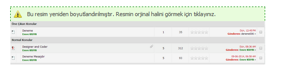
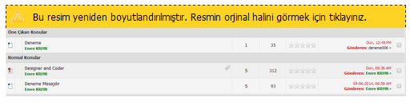
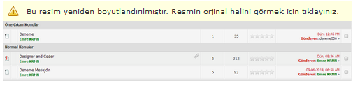

MyBB için Ncode Eklentisi

 Eklenti ismi: Mybb Ncode Eklentisi  Eklenti Yapımcısı: Emre Karakaya  Eklenti Güvenlimi ?: Güvenli   Eklenti Versiyonu:  1.0   Test Durumu: Denemiştir-sorunsuz   Uyumlu Olduğu Sürüm-(ler): MyBB - 1.8.x  Eklenti Açıklaması: Eklenti ile Mybb Forumunuzdaki resimleri çok basit bir şekilde boyutlandırabileceksiniz.Eklenti 3 ncode teması ile geliyor.Bu temalar ;

 Xpserkan 1.8 Ncode Teması

1.6 Turuncu Ncode Teması

Wordpress Ncode Teması

Ayrıca eklentide resimleri Aynı sayfada , Resime yönlendirerek , Yeni pencerede Resim ve Ncodebox seçenekleri ile orjinal hale getirme eklenmiştir.Eklenti ile boyutlandırmak istediğiniz resimlerin Genişlik ve yükseklik  değerlerini seçebilirsiniz.

 Eklenti Kurulumu: Dosyaları Ftp hesabınıza atarak eklentiyi aktifleştirin.Daha sonra ayarlarını yaparak kullanmaya başlayabilirsiniz.  Demo Link: mybbrehberi.com

İndirme Adresleri

**[Github](https://github.com/EmreKarakaya/mybb-ncode)**

**[Bitbucket](https://bitbucket.org/EmreKarakaya/mybb-ncode/src/b6127a885440?at=master)**

[**MybbDepo**](https://tr.mybbdepo.com/mybb-ncode-resim-boyutlandirma-eklentisi-konusu.html)
