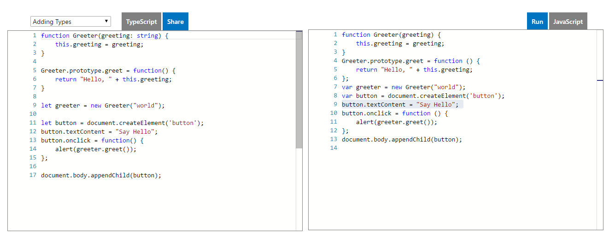

Merhaba

Yaklaşık 1 yıl miskinlik döneminden sonra blogumu düzene koyduktan sonra kendimi geliştirmek için Angular 2 öğrenmeye karar verdim. Ancak Angular 2 anlatımlarında sürekli geçen bir **TypeScript** kavramı vardı. Ben bu TypeScript kavramını Google de arattığımda ise birçok teknik bilgili tanım ve anlatım vardı.<!--more--> Ancak benim gibi acemi webmasterleri tatmin edecek ve kafasında TypeScript'i canladıracak bir içerik yoktu. İşte size bu yazımda bir acemi webmasterin gözünden **TypeScript nedir** onu anlatmaya çalışacağım.

Bildiğiniz üzere son yıllar da node.js ve goo.js çıkmasıyla javascript sadece html sayfalarda kullanılan bir dil olmaktan çıkmış ve artık sunucular da kullanılan bir dil oldu. Yani kullanım alanı gelişti ve büyük projelerde tek başına kullanılmaya başlandı. Ancak javascriptin esnek yapısının verdiği kolaylık büyük projeler de belli bir süre sonra projenin analizinde ve yönetiminde karmaşaya yol açmaya başladı. Ayrıca javascript dilinin diğer diller gibi nesnel bir yapıya sahip olmaması büyük bir karmaşaya yol açıyordu. İşte bu yüzden **Microsoft TypeScript** denilen programlama dilini çıkardı.

TypeScript yukarıda bahsetmeye çalıştığım sorunlara çözüm olarak çıkarılan bir dil. Temel olarak javascript diline dayanıyor. Ancak javascriptten farklı olarak nesnel bir yapıya sahip. Yani TypeScript de class ve interface yapılarını kullanabiliyorsunuz.Böylece karmaşalardan kurtulabiliyorsunuz.

Şimdi aklınızda TypeScript canlandığına göre nasıl çalıştığına bir göz atalım. TypeScript temel olarak .ts uzantılı dosyalarda çalışıyor. Kodlarınızı istediğiniz bir IDE programıyla ts dosyasına yazdıktan sonra kodlarınız aynı .Net framework de ki gibi derleniyor ve javascript diline dönüştürülüp yorumlanıyor. Yani siz TypeScript'e göre yazarken sunucu ve kullanıcılar bu dili javascript diline göre yorumluyorlar. Bu yüzden herhangi bir tarayıcıda uyumluluk sorunu ortaya çıkmıyor. Bu kısım biraz karışık oldu bu yüzden aşağıdaki linkte ki örneği inceleyelim.

\[caption id="" align="aligncenter" width="1322"\] TypeScript Örneği\[/caption\]

Resimde gördüğünüz üzere sol taraftaki kodlar TypeScript kodları sağ taraftaki kodlar ise derlendikten sonra sunucuda yorumlanan javascript kodu... Gördüğünüz üzere TypeScript ile yazdığınız nesnel tabanlı kod derlendikten sonra herhangi bir ekstra programa gerek olmadan javascript olarak yorumlanıyor. Böylece herhangi uyumluluk sorunu ortaya çıkmadan kodlar doğru şekilde çalışıyor.

Makalenin son kısımları karışık olmasına rağmen anlaşılır bir makale yazmaya çalıştım. Sorularınız olursa sormaya çekinmeyiniz.

Hayırlı Günler
