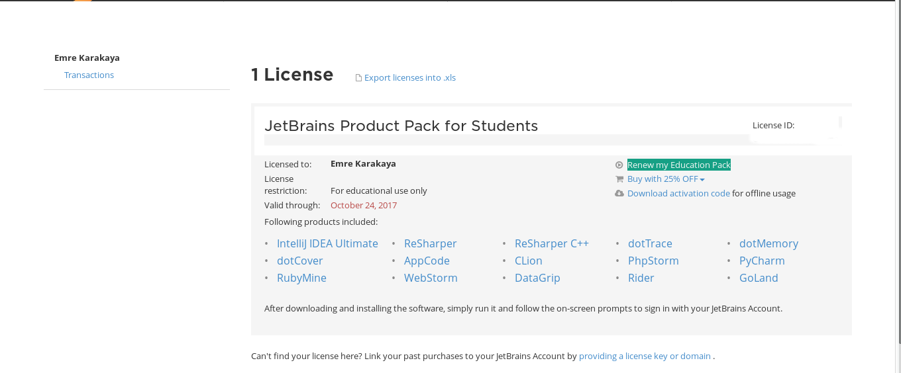

Merhaba Arkadaşlar

Jetbrains bildiğiniz üzere çeşitli diller de ide programları geliştiren ünlü bir şirket. Daha önceki blog yazılarımda belirttiğim üzere Angular 2 ve Typescript denemelerimi yapabilmem için bir ide programı arıyordum. <!--more--> Araştırmalarım sonucunda Jetbrains WebStorm programı ile karşılaştım. İde programı güzeldi ancak 1 yıllık fiyatı 129.00 dolar daha da güzeldi. Ancak yılmayıp araştırdım ve sonunda Jetbrains şirketinin ide programlarını öğrenci ve öğretmenlere ücretsiz olarak 1 yıllığına lisansladıklarını öğrendim. Şimdi size ünlü Jetbrains ide programlarını nasıl 1 yıl ücretsiz kullanabileceğinizi anlatacağım.

## Jetbrains Ücretsiz Lisans Nasıl Alınır?

1. **[Buraya](https://www.jetbrains.com/student/)** tıklayarak Jetbrains öğrenci sayfasına giriş yapın. Açılan sayfada Jetbrains'in öğrenci ve öğretmenlere ücretsiz sunduğu programları görebilirsiniz. Programları inceledikten sonra alt taraftaki Apply Now butonuna tıklayın.
2. Açılan sayfada sizden doğrulama için çeşitli bilgiler istenecek. Sizden istenen doğrulama bilgiler ile;
    - Üniversitenizin size vermiş olduğu mail adresini kullanarak
    - ISIC (Uluslararası Öğrenci Kartı) ve ITIC (Uluslararası Öğretmen Kimlik Kartı) kartlarını kullanarak ( Bu kartlar ülkemizde 6 ilde geçerlidir.Detaylı bilgi almak için [**Buraya**](https://www.isic.org.tr/hakkimizda/faqs/) tıklayın.)
    - Üniversitenizin size verdiği belgenin fotoğrafını yollayarak ( Bazı arkadaşlar e-okul notlarının fotoğrafını kullanıp doğrulama alabilmiş. Denemek lazım :) )ile doğrulama yapınız.
3. Formu gönderdikten sonra mail adresinize doğrulama kodu geliyor. Bu doğrulama kodunun gelme süresi öğrenci mail adresi ile doğrulama yapıyorsanız hemen, ISIC ve ITIC kart numaralarıyla doğrulama yapıyorsanız birkaç saat (Kartım olmadığı için tam olarak bilmiyorum. Twitter de ki yorumlardan edindiğim bilgi ) , fotoğraf yollayarak doğrulama yapıyorsanız birkaç günü bulabilmektedir.
4. Doğrulama mailindeki linke tıkladığınız zaman sizden klasik kullanıcı adı, şifre, gizli soru ekranı gelir. Bu bilgileri doldurduktan sonra size lisans anahtarınızın verildiği ekran açılır.

Bütün adımları doğru yaptıysanız ücretsiz olarak 1 yıllık Jetbrains İde programlarını kullanabilirsiniz.

## Jetbrains Ücretsiz Lisans Nasıl Yenilenir?

1. Jetbrains hesabınıza giriş yapın
2. Giriş yaptıktan sonra aşağıda ki resimde işaretli olan Renew my Education Pack bölümüne tıklayın ve yukarıda ki adımları tekrarlayıp ücretsiz lisansınızı yenileyebilirsiniz.

Sorularınızı buradan sorabilirsiniz.

Hayırlı Günler
