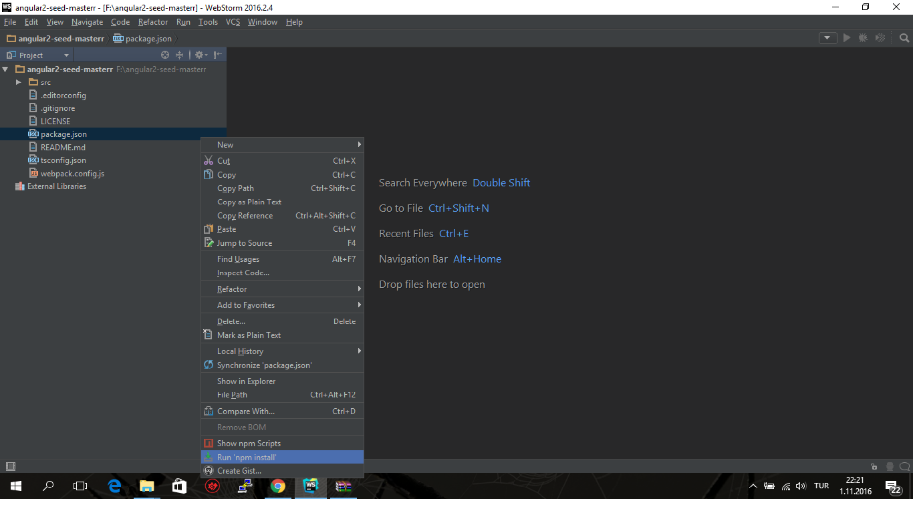
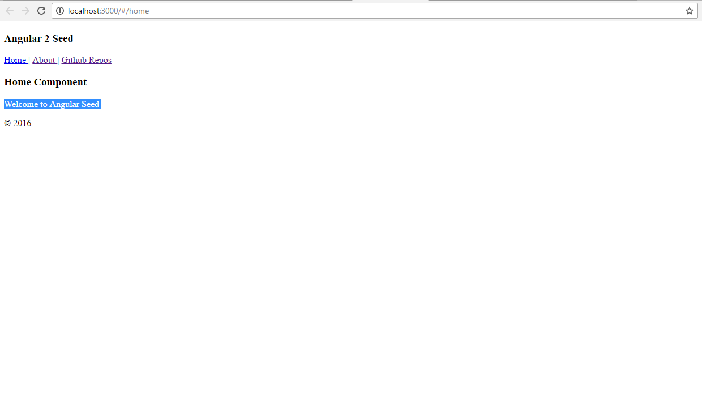
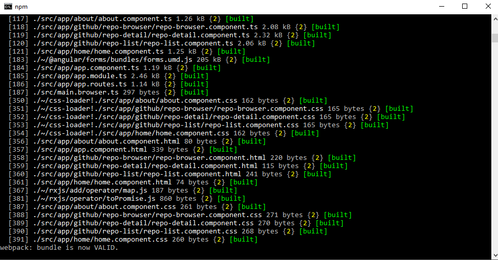

Merhaba Arkadaşlar

Daha önceki yazımda Angular 2 CLI kurulumunu anlatmıştım.Şimdi de size Webstorm IDE kullanarak nasıl Angular 2 kurup çalıştırabileceğinizi anlatacağım.Ancak anlatıma başlamadan nasıl ücretsiz Webstorm IDE lisansı alacağınızı [burada](http://www.emrekarakaya.com.tr/jetbrains-ogrenci-ve-ogretmen-icin-ucretsiz-lisans/) anlattım.

Aşağıdaki adımları uygulayınız.

1. **[Buraya](https://github.com/angular/angular2-seed/archive/master.zip)** tıklayarak örnek Angular 2 Proje dosyasını indiriniz ve istediğiniz bir klasöre çıkartın.
2. Webstorm IDE programını açınız ve proje klasörünü gösteriniz.
3. Webstorm IDE programında sol tarafta bir dosya dizini var.Yapmanız gereken öncelikle src klasörüne girmeniz.Daha sonra bu dosya dizininde package.json dosyasına sağ tıklayın ve Run npm install seçeneğine tıklayın.Örnek resim burada ; 
4. Npm install bittikten sonra proje klasörüne gelip yönetici haklarıyla komut penceresini açın ve npm start komutunu girin.
5. Bu işlemleri yaptıktan sonra http://localhost:3000 adresine girerek Angular 2'nin doğru çalıştığını kontrol ediniz.

Doğru çalışan Angular 2

\[caption id="" align="aligncenter" width="973"\] Örnek bir npm start komutu\[/caption\]

Sorularınız için yorum bölümünü kullanabilirsiniz.

Hayırlı Günler.
