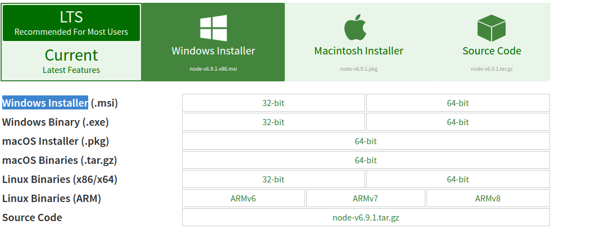

Linux için Node.js ve Npm kurulumunu paylaştıktan sonra Windows için paylaşmamak haksızlık olurdu. Bugün sizinle beraber Windows'a Node.js ve Npm Kuracağız.

<!--more-->

Linux ta ki kuruluma göre Windows ta ki kurulum sadece Next butonuna tıklamakla geçiyor. Yani sunucu taraflı bir dili bilgisayarımıza kuruyoruz ama sadece next diyerek kuruyoruz. Hiç bir şekilde 1 satır kod yazmıyoruz. (Şimdi neden Linuxa geçtiğimi anlamışsınızdır. Gerçi Linux da da kodu kopyala yapıştır yaparak yüklüyoruz :) ) Kuruluma geçersek ;

1. **[LTS, STS Ve Current Nedir?](http://www.emrekarakaya.com.tr/lts-sts-ve-current-nedir/)** yazımızı inceledikten sonra [**buraya tıklayarak**](https://nodejs.org/en/) Node.js sitesine gidin.
2. Kendinize uygun sürümü seçtikten sonra Windows Installer bölümünden bilgisayarınızın 32 bit ya da 64 bit durumuna göre msi dosyasını indirin. Aşağıda ki resimde nerede olduğu görünüyor.
3. İndirdiğiniz msi dosyasını açın ve Next diyerek kuruluma başlayın. Burada dikkat etmeniz gereken Node.js ve Npm'yi kuracağınız klasörü seçebiliyorsunuz. Eğer Yerel Disk C de fazla alan yoksa hızlı next yaparken kurulum bölümü seçme kısmını kaçırmayın.
4. Kurulum bittikten sonra komut istemini açıp aşağıda ki kodu girip Node.js doğru kurulup kurulmadığını denetleyin.
    
    ```
    node -v
    ```
    
5. Komut isteminde aşağıda ki kodu girip Npm doğru kurulup kurulmadığını denetliyin.
    
    ```
    npm -v
    
    ```
    

Sorularınızı yorum olarak sorabilirsiniz.

Hayırlı Günler
