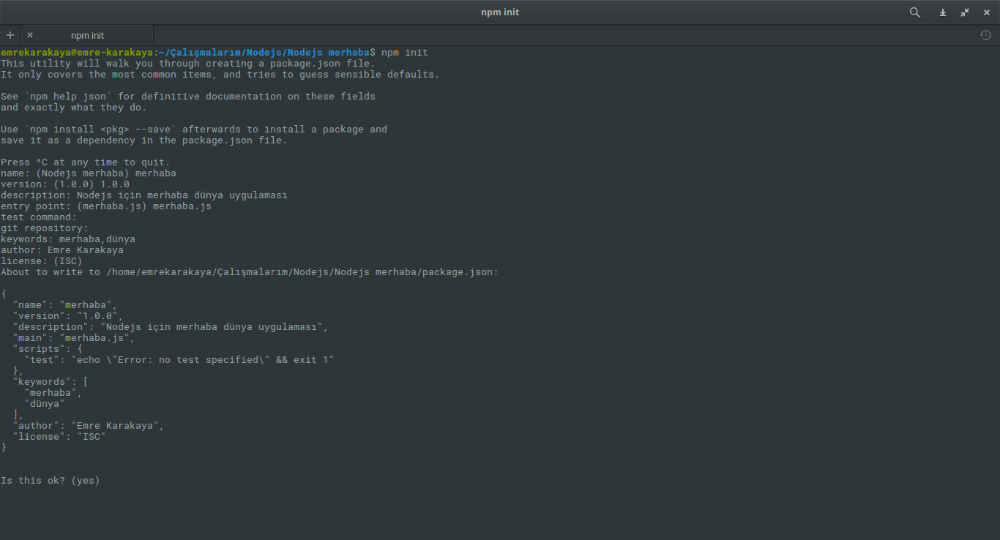

Npm açılımı Node Packaged Modules anlamı ise Node Paketlenmiş Modülleridir\*. Npm Node.js için gereken modülleri yüklemek, silmek, güncellemek ve listelemek için kullanılan paket yöneticisidir. Açıklamadan da anlayacağınız üzere bugün sizinle Node.js 'ye modül yükleyip silip güncelleyeceğiz.

<!--more-->

Npm kurulumunu Linux ve Windows için daha önceki yazılarımda anlatmıştım. Kurulumunu yapmamış arkadaşlar Linux için **[buraya](http://www.emrekarakaya.com.tr/linux-icin-nodejs-ve-npm-kurulumu/)** Windows için [**buraya**](http://www.emrekarakaya.com.tr/windows-icin-node-js-ve-npm-kurulumu/) tıklayabilir. Kurulumu yaptıktan sonra sizinle Npm'yi tanıyalım.

### Npm Nedir?

Npm Node.js ile birlikte çalışır ve Node.js 'nin paket yöneticisidir. Windows bilgisayarlarda Node.js kurulumu ile birlikte gelse de Linux da kurmak için ayrı bir komut gerekiyor. Npm Node.js uygulamaları için yüklemek, silmek, güncellemek,listelemek vb. amaçlar için kullanılıyor. Gelin sizinle bu komutları inceleyelim.

**Uyarı**: Komutlar da kullanacağım modül adı colors tur. Siz colors yerine kurmak istediğiniz modül ismini yazabilirsiniz. **Uyarı 2:** Yazıyı direk okumadan direk kodlara bakan arkadaşlar için bu uyarıyı yapmak zorundayım. Kodların sonunda ki --save-dev kodu kurulan modül isminin package.json'a kayıt edilmesi içindir. Package.json dosyası kullanmadan çalışıyorsanız --save-dev kodunu kullanarak çalışınız.

Şimdi Node.js projenizin olduğu klasöre girin ve **Yönetici(root)** olarak Komut istemi ya da Terminali açın.

### Package.json Dosyası Oluşturma

Package.json dosyası projeniz ile bilgilerin tutulduğu json dosyasıdır. Bu json dosyasında projenizin adı, açıklaması, anahtar kelimeleri, git sayfası, lisansı, versiyonu, başlama dosyası ve test komutu bulunur. Bu dosyayı oluşturmak için

```
npm init
```

komutunu girebilirsiniz. Örnek resimi aşağıda bulabilirsiniz. Oluşturulan package.json dosyası sizin proje klasöründe saklanır.



### Npm Modül Kurulumu

Npm modül kurulumu isteğinize bağlı olarak iki türlü yapılır. Bunlar ;

1. Tek projeniz var ya da modülü sadece 1 projenize kuracaksanız
    
    ```
    npm install colors --save-dev
    ```
    
    kodunu girerek modülü kendi proje klasörümüze yükleyebiliriz. Burada ki --save-dev kodu ile yüklediğimiz modül aşağıda ki kod ile package.json dosyasına kayıt oldu.
    
    ```
      "devDependencies": {
        "colors": "^1.1.2"
      }
    ```
    
    Gördüğünüz üzere modül ismi ve sürümü package.json dosyasına kayıt oldu. Böylece ileri ki zamanlarda sunucu taşıma gibi durumlarda direk package.json ile bütün modülleri toplu olarak kurabiliriz.
2. Eğer birden fazla projeniz varsa ve kuracağınız modülü birden fazla projenizde kullanacaksanız da kodunuzun sonuna -g eklemeniz ile modülü tüm projeleriniz için kurabilirsiniz.
    
    ```
    npm install colors --save-dev -g
    ```
    
    Bu global olarak kurulan modüller işletim sistemine göre aşağıda ki klasörlere kurulur.

- Windows için : C:\\Users\\{Kullanıcı adı Parantezleri silin}\\AppData\\Roaming\\npm
- Linux için : /usr/lib/node\_modules/
- Mac için : /usr/local/lib/node\_modules/

Global olarak kurulan modülleri oluşturduğunuz veya oluşturacağınız bütün projelerinizde kullanabilirsiniz.

### Npm Modül Güncelleştirme

Npm modül güncelleştirme yapmadan önce hangi modülün yeni sürümü gelip gelmediğini öğrenmemiz lazım. Bunu öğrenmek için ;

1. Sadece proje klasörünüzde ki modüller için
    
    ```
    npm outdated
    ```
    
     
2. Global olarak yüklediğiniz modüller için
    
    ```
    npm outdated -g
    ```
    

koduyla öğrenebilirsiniz. Ben global kurduğum modülleri güncellemek için kodu çalıştırdım ve resimde gördüğünüz üzere npm sürümüm güncel olmadığı ortaya çıktı. Ancak sizde güncel olmayan modüller çıkacaktır. Aşağıda ki resimi inceleyebilirsiniz.


Güncel olmayan npm modüllerini yine iki şekilde güncelleştirebilirsiniz. Yanlız burada dikkat etmeniz gereken konu global olarak kurduğunuz modülleri **sadece** global olarak güncelleyebilirsiniz. Güncelleme yolları ;

1. Proje klasörüne kurduğunuz modülü güncellemek için aşağıdaki kodu kullanabilirsiniz.
    
    ```
    npm update colors --save-dev
    ```
    
2. Global olarak yüklediğiniz modülü güncellemek için aşağıdaki kodu kullanabilirsiniz.
    
    ```
    npm update colors --save-dev -g
    ```
    
     

### Npm Modül Silme

Npm modül silme her zaman ki gibi iki türlü yapılır. Bunlar ;

1. Proje klasörüne kurduğunuz modülü kaldırmak için
    
    ```
    npm uninstall color --save-dev
    ```
    
2. Global olarak yüklediğiniz modülü kaldırmak için her zamanki -g etiketi kullanacağız
    
    ```
    npm uninstall color --save-dev -g
    ```
    

 

### Package.json ile Modül Yükleme

Yazının başında size kullandığımız --save-dev kodumuzun package.json dosyasına modüllerimizi kayıt ediyorduk. Şimdi sunucu taşıdığımızı farz edelim projemizin kendi klasöründe ki modülleri kuracağız. Her modülü tek tek kurmak inanılmaz bir işkencedir. Peki package.json ile nasıl kurabiliriz?

Package.json ile sadece

```
npm install
```

komutu ile modülleri kurabiliriz.

Yazı ilk okumada biraz karışık gelebilir ama ilk fırsatta sizin için videolu anlatım çekeceğim. Sorularınızı yorum olarak sormaktan çekinmeyin.

Hayırlı Günler
