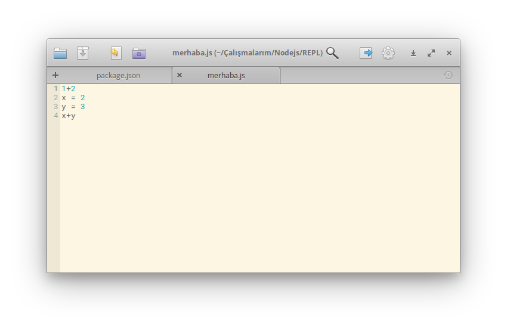
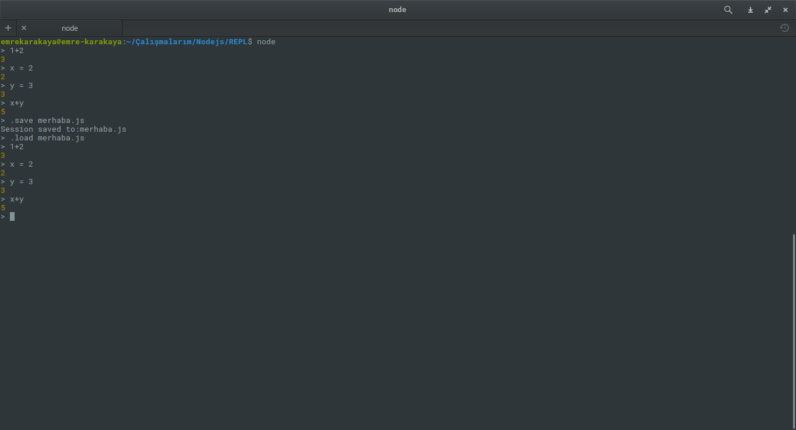

Bir önceki yazımızda ([REPL Nedir? Ne İçin Kullanılır?](http://www.emrekarakaya.com.tr/repl-nedir-ne-icin-kullanilir/)) REPL'i tanıtmış REPL'in Node.js tarafından kullanıldığını belirtmiştim. Bugün sizinle beraber Node.js REPL komutlarını inceleyeceğiz.

<!--more-->

Komutları denemek için bilgisayarınızda node.js kurulu ise terminal veya komut istemine node yazarak deneyebilirsiniz. Kurulu değilse [buraya tıklayarak](https://www.tutorialspoint.com/nodejs_terminal_online.php) açılan terminale node yazarak kodları deneyebilirsiniz.

### Matematik Komutları

REPL ortamını kullanarak basit matematik problemlerini çözebilirsiniz. Böylelikle facebook sayfalarında ki matematik problemlerine doğru cevabı siz verebilirsiniz. :)

### Değişken Tanımlama

REPL ortamını kullanarak x,y,z 'e değer verebilir ve bunlarla basit matematik işlemler yapabilirsiniz. Örneğin x ve y nin toplamlarını alalım. Girmeniz gereken komut satırı ;

```
x = 2
y = 3
x+y
```

Çözmek istediğiniz matematik işlemine göre komut satırını değiştirebilirsiniz.

### .break Komutu

Bu komutu kullanarak birden fazla satırdan oluşan komutlardan çıkmanızı sağlar. Örnek kod kullanımı aşağıdaki gibidir.

```
> var x=4
undefined
> while(x<=10)
... { x=x+1;
... .break
```

### .clear Komutu

.clear komutu da .break komutu gibi birden fazla satırdan oluşan komutlardan çıkmamızı sağlar. Örnek kod kullanımını aşağıdaki gibidir.

```
> { x=x+1;
..... .clear
>
```

### .help Komutu

.help komutu size kullanabileceğiniz REPL komutlarını gösterir. Tek yapmanız gereken terminal ekranına .help komutunu yazmaktır.

### .save Komutu

.save komutu terminalde denediğiniz REPL komutlarını dosyaya kayıt etmenizi sağlar. Böylece kodları tekrar girmek zorunda kalmasınız. Yapmanız gereken .save dosyadi.js şeklinde komutunuzu girmektedir. Dosya adını istediğiniz gibi düzenleyebilirsiniz. Kayıt edilen dosyanın ekran resmi aşağıdaki satırdadır.



### .load Komutu

.load komutu ile üstteki resimde görülen .save komutu ile kayıt ettiğiniz dosyadan REPL komutlarını çağırabilirsiniz. .save ve .load için örnek terminal resmi aşağıda ki satırdadır.



 

Gördüğünüz gibi öncelikle .save merhaba.js kodu ile REPL komutlarını merhaba.js dosyasına kayıt ettik. Daha sonra da .load merhaba.js komutunu yazıp REPL komutlarını bir tıkla çektik.

### .exit Komutu

.exit komutu adından anlaşıldığı gibi REPL ve Node ekranından tamamen çıkmanızı sağlar.

### Tuş Komutları

REPL çeşitli komutlar algıladığı gibi çeşitli tuşlara basarak da komut verebilirsiniz. Bu tuşlar ;

- CTRL + C komutu ile mevcut komutu sonlandırabilirsiniz. Bir bakıma .break ve .clear ile işe yarar ama bu komut daha hızlı ve pratik.
- CTRL + C komutuna iki kere basmanız durumunda .exit komutunun yaptığı gibi sizin REPL ve Node ekranından tamamen çıkmanızı sağlan
- CTRL + D komutu yine .exit komutunun yaptığı işlemi yapar. Ancak daha hızlı ve pratiktir.
- Yukarı ve Aşağı Ok Tuşları  daha önce vermiş olduğunuz komutları görmenizi sağlar. İsterseniz bu komutları tekrar yazmadan kullanabilirsiniz.

Sorularınızı yorum olarak sorabilirsiniz.

Hayırlı Günler
