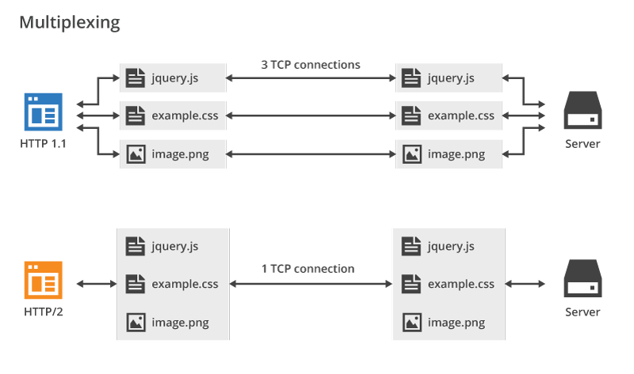

Yıllardır kullandığımız HTTP 'nin yeni sürümü HTTP/2 ya da HTTP 2.0 'ı sizler için araştırdım. <!--more-->

## HTTP/2 Nedir?

> **HTTP/2** (orijinal ismi **HTTP/2.0**) Dünya Çapında Ağ Birliği (Wold Wide Web ) tarafından kullanılan HTTP ağ protokolünün ikinci ana sürümüdür. SPDY tabanlıdır. HTTP/2 İnternet Mühendisliği Çalışma Kolu’nun (Internet Engineering Task Force) Hiper Metin İletim Protokolü çalışma grubu( httpbis, bis burada “tekrar” veya “iki defa” anlamına gelmektedir.) tarafından geliştirilmiştir.
> 
> — [HTTP/2 - Vikipedi](https://tr.wikipedia.org/wiki/HTTP/2)

Yukarıda ki metinin türkçesi ise şu: HTTP/2 1999 yılından beri kullandığımız HTTP/1.1 'nın yerini alacak yeni HTTP sürümü. Taban olarak Google' in SPDY protokolünü temel alır. Daha önceki sürüm HTTP/1.1 den farklı olarak SSL veya TLS şifrelemeye ihtiyaç duyar. Yani HTTP/2 kullanmak için öncelikle SSL veya TLS kullanmanız gerekecek.

## HTTP/2 Ve HTTP/1.1 Farkları Nelerdir?

- HTTP/2 HTTP/1.1' den farklı olarak SSL veya TLS şifrelemeye ihtiyaç duymaktadır.
- HTTP/1.1 sitenizde bulunan her statik dosya için (css,js,resim,video vb.) ayrı istekler gönderir. Bu da sitelerinizin açılma süresinin artmasına neden olur. HTTP/2 ise statik dosyalar toplu bir şekilde tek bir istek gönderir. Bu da açılma süresini kısaltır. Örnek olarak aşağıda ki resme bakabilirsiniz.
    
    
    
    Gördüğünüz üzere HTTP/2 HTTP/1.1'den farklı olarak statik dosyalar için tek bir istek gönderiyor.Bu da açılma süresini fark edilir bir biçimde kısaltıyor.
- HTTP/2 de isteklerin tarayıcı tarafından yorumlanması kaldırıldı.
- HTTP/2 sitenizin üst bilgilerini sıkıştırılarak kullanıcıya ulaştırılması sağlanır. Örnek bir üst bilgi ;`HTTP/1.1 302 Found Content-Type: text/html Content-Length: 1123 Date: Fri, 21 Jul 2017 20:38:41 GMT Accept-Ranges: bytes Cache-Control: no-cache, no-store, must-revalidate, max-age=0 Location: https://www.emrekarakaya.com.tr/ Connection: Keep-Alive`

### HTTP/2 İle HTTP/1.1'i Kıyaslayın

Aşağıda eklediğim siteler ile HTTP/2 ve HTTP/1.1 arasında perfonmans değerlendirmesi yapabilir ve açılış sürelerini kıyaslayabilirsiniz.

- [https://http2.akamai.com/demo](https://http2.akamai.com/demo)
- [http://www.http2demo.io/](http://www.http2demo.io/)

## HTTP/2 Nasıl Kurabilirim?

Eğer paylaşımlı bir hosting (Web hosting, Reseller hosting vb.) kullanıyorsanız HTTP/2 kurulumu için firmanıza başvurmanız gerekmekte. Ancak sunucu yönetimi sizde ise kullandığınız web servere göre aşağıda kurulum yapabilirsiniz.(Başlamadan önce SSL veya TLS sertifika kullandığınız varsayılmıştır.)

### Apache HTTP/2 Kurulumu

Başlamadan önce lütfen mod\_http2 modülünün sunucunuz da kurulu olduğundan emin olun. Sonra aşağıda ki adımları uygulayın.

- İlk olarak httpd.conf dosyasını açınız. Aşağıda ki kodu uygun bir bölüme ekleyiniz.
    
    ```
    LoadModule http2_module modules/mod_http2.so
    ```
    
- Uygun bir bölüme aşağıda ki kodu ekleyiniz.Bu kod ile tüm istekleri HTTP/2 ile yapacağız.
    
    ```
    Protocols h2 h2c http/1.1
    ```
    
    **Dikkat:** HTTP/2 'nin belirli sitelerinizde çalışmasını istiyorsanız aşağıda ki kodu düzenleyip kullanabilirsiniz.
    
    ```
    Protocols http/1.1
    <VirtualHost ...>
        ServerName test.example.org
        Protocols h2 http/1.1
    </VirtualHost>
    
    ```
    

 

### Nginx HTTP/2 Kurulumu

 

- - Nginx de HTTP/2 kurulumu için ilk olarak nginx.conf dosyasını açınız. (Sadece belirli sitelerinizde kullanmak istiyorsanız aşağıda ki işlemi istediğiniz sitenin conf dosyasında yapınız.)

 

- Aşağıda ki bölümü bulun ve uygun bölüme 3. adımda ki listen kodunu ekleyin.
    
    ```
    server 
    {
    
    ```
    
- Uygun bölüme aşağıda ki kodu ekleyin.
    
    ```
    listen 443 ssl http2 default_server;
    ```
    
    Örnek kodlama ;
    
    ```
    server {  
            server_name domain.com www.domain.com;
            listen 443 ssl http2 default_server;
            root /var/www/html;
            index index.html;
    
            location / {
                    try_files $uri $uri/ =404;
            }
    
            ssl_certificate /etc/nginx/ssl/domain.com.crt;
            ssl_certificate_key /etc/nginx/ssl/domain.com.key;
    }
    ```
    

### Litespeed HTTP/2 Kurulumu

Litespeed de HTTP/2 kurulumu için herhangi bir şey yapmanıza gerek yoktur. Litespeed kurulumunda default olarak gelmekte ve ssl kurulumundan sonra otomatik olarak çalışmaktadır.

## Final

Yazım da size HTTP/2 'yi tanıtmaya ve HTTP/1.1 'den üstünlüklerini ortaya koymaya çalıştım. Sorularınız olursa yorum olarak sorabilirsiniz.

Hayırlı Günler
