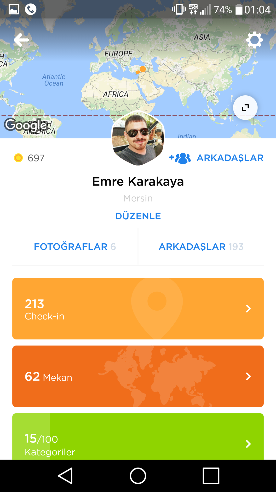
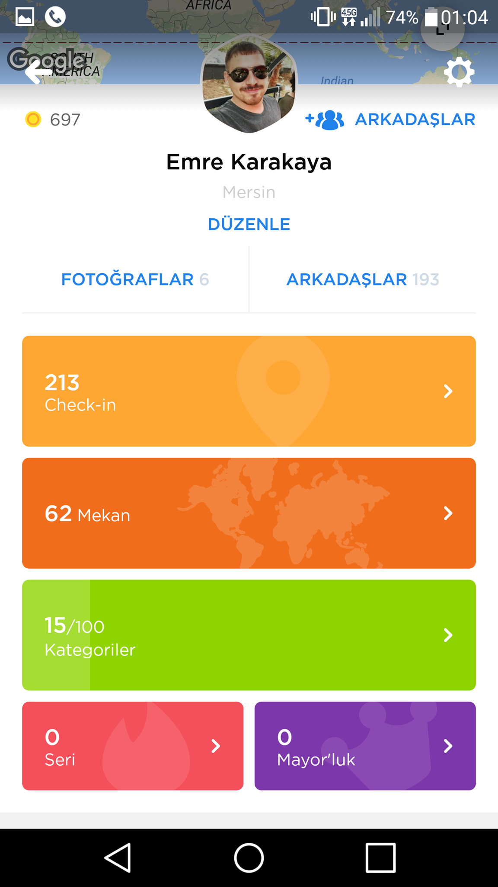
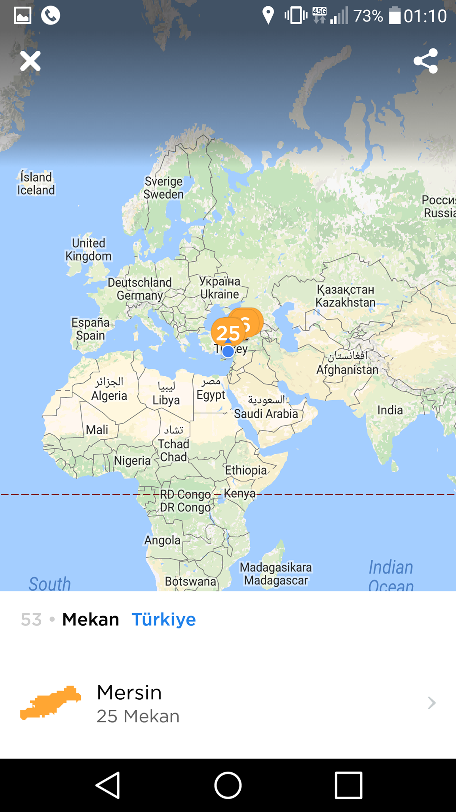

Bugün sizinle Swarm 5.0 güncellemesini inceleyeceğiz.

<!--more-->

## Swarm Nedir?

 

> **Swarm**; ilk olarak 5 Mayıs 2014 tarihinde mobil yazılımlardan iOS ile Android'e uygun olarak, kullanıcıların nerede olduklarını paylaşması için çıkan bir uygulama. tarafından üretilen bu uygulamanın işlevi; kullanıcıların olduğu yerde check-in yaparak yerlerini bildirmelerini, yerini bildiren kullanıcının ekli olan arkadaşlarının da bunu görüp ona ne kadar yakında olduklarını öğrenmelerini ve eğer gerçekten birbirlerine yakınlarsa herhangi bir yerde buluşmalarını sağlamaktadır.
> 
> — [Swarm – Vikipedi](https://tr.wikipedia.org/wiki/Swarm_\(uygulama\))

## Swarm 5.0 Güncellemesi

Swarm daha önceki sürümlerinde insanların check in ederek etiket ve mayorluk kazanmasını sağlayan bir oyun üzerine kuruluydu. Swarm yeni gelen 5.0 güncellemesiyle check in yapmayı oyun olmaktan çıkarıp "lifelog" adını verdiği kişisel seyahat günlüğüne dönüştürmeyi hedefliyor. Swarm 5.0 güncellemesi ile daha önceden seyahat ettiğiniz mekanları kayıt altında tutmak hatırlamanızı sağlıyor.

## Swarm 5.0 Güncellemesi İle Gelen Değişimler

1. 1. Görünüm modern hale getirildi. Önceki sürümlerde göz yoran kısımlar çıkarılarak Swarm sade ve modern bir görünüme kavuştu.
        
        \[caption id="" align="aligncenter" width="1152"\] Swarm Ana Ekran\[/caption\]

 

1. 1. Profil sayfası yenilendi. Artık profil sayfanızda her şey daha toplu hale getirilip görsel açıdan daha güzel bir görünüme kavuştu. Profil sayfanızda kaç check in yaptığınız , kaç mekanı ziyaret ettiğiniz, kaç kategoriyi açtığınız, kaç seriniz olduğunu ve kaç mayorunuz olduğunuzu gösterecek.
        
        \[caption id="" align="aligncenter" width="1152"\] Swarm Profil Ekranı\[/caption\]
        
        \[caption id="" align="aligncenter" width="1152"\] Swarm Profil Ekranı\[/caption\]
    2. Önceden yaptığınız yer bildirimlerinin tutulduğu harita bölümü interaktif şekilde karşımıza çıkıyor.
        
        \[caption id="" align="aligncenter" width="1152"\] Swarm İnteraktif Harita\[/caption\]

 

1. Yeni güncelleme ile kategori sayısı 100 e çıkarıldı.Böylece daha fazla coin kazanıp arkadaşlarınızla daha keyifli rekabet edebilirsiniz.
2. Swarm 5.0 güncellemesi ile daha önce check in yaptığınız mekanlar daha fazla bilgi sahibi oluyor. Yani daha önceden check in yaptığınız mekanına gittiğiniz zaman Swarm size mekan ile yenilikleri ve bilgileri sunabilecek.

 

## Final

Yazım da size Swarm 5.0 güncellemesi gelen özellikleri ve değişimleri anlatmaya çalıştım. Umarım yararlı olmuştur.

Hayırlı Günler
