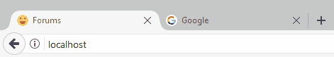

 Eklenti ismi: MyBB Dont'go Eklentisi  Eklenti Yapımcısı: Emre Karakaya

<!--more-->  Eklenti Güvenlimi ?: Güvenli   Eklenti Versiyonu: 1.0  Test Durumu: Denemiştir-sorunsuz   Uyumlu Olduğu Sürüm-(ler): MyBB - 1.8.x  Eklenti Açıklaması: Don't Go sitenizi sekme olarak bırakıp ayrılan kullanıcıları geri çekmek amacıyla kullanılır. Belirli bir süre içinde kullanıcı sitenizi pasif sekme olarak açık bırakınca site **favicon ve title** otomatik değişir. Ben de bu yararlı eklentiyi Wmaracı'nda görüp Mybb uyarladım. Eklenti ile siteniz belirlediğiniz süre boyunca pasif sekme kalınca otomatik favicon ve title değiştirecektir. Örnek aşağıda ki resim;

 

 Canlı Demo Link: [https://demo.emrekarakaya.com.tr/](https://demo.emrekarakaya.com.tr/)

İndirme Linkleri:

- **[Github](https://github.com/EmreKara5aya/Mybb-Don-t-Go-Plugin/archive/master.zip)**
- **[Mybb Uzmanı](https://mybbuzmani.com/attachment.php?aid=2)**
