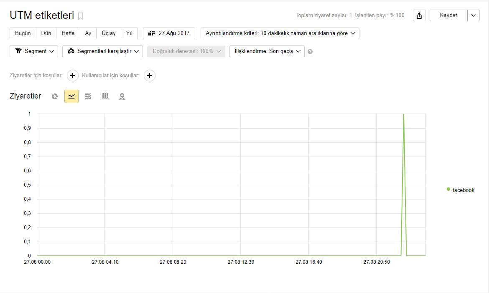
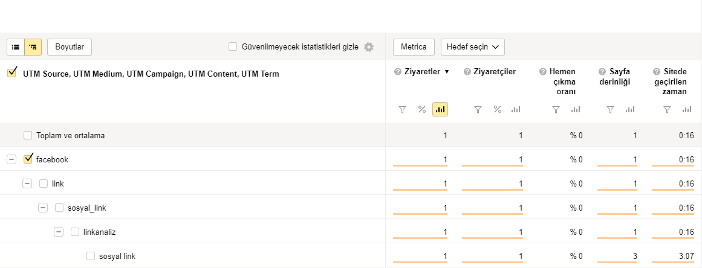
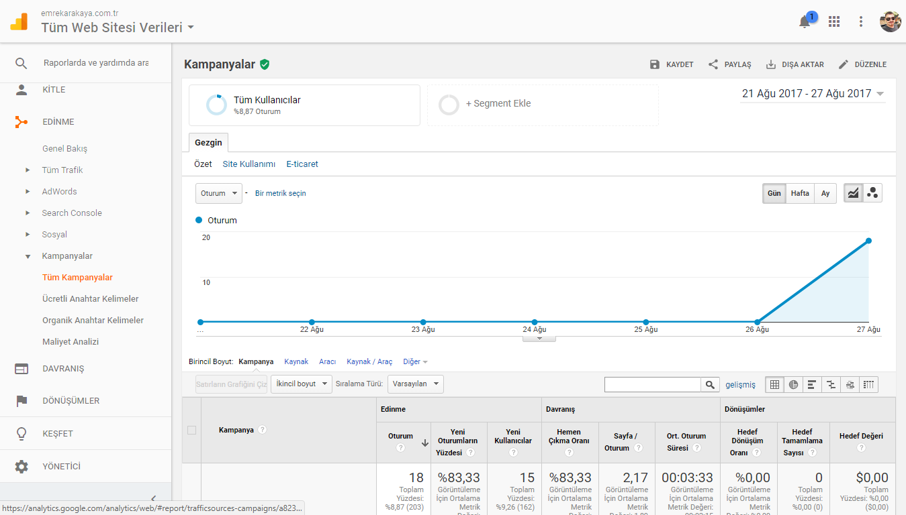
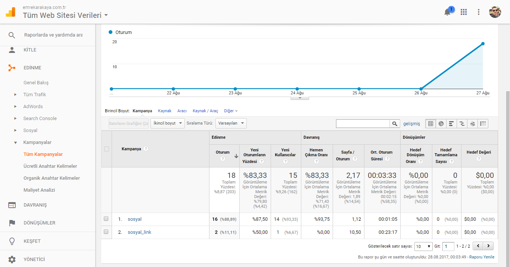

Bugün sizinle UTM Link Takip Kodları ile linklere hükmedeceğiz.

<!--more-->

## UTM Nedir?

UTM açılımı Urchin Tracking Module olan sitenize gelen linkleri daha kolay ve detaylı analiz edilmesi için 2005 yılından beri kullanılan link takip kodlarıdır.

## UTM Neden Kullanılmalı?

UTM takip kodları sitenize gelen linkleri detaylı olarak analiz etmenizi sağlar. Bu sayede sitenize hangi kaynaktan ne kadar ziyaretçi geldiğini öğrenebilir plan ve taktiklerinizi buna uygun şekilde geliştirebilirsiniz.

## UTM Nerelerde Kullanılabilir?

UTM türkçe kaynaklarda sadece reklam linkleri olarak anlatılsa da detaylı analiz için tüm linklerinizde kullanabilirsiniz. UTM linkleri için örnek vermek gerekirse ;

- En klasik örnek ile başlarsak verdiğiniz reklamların dönüşlerini takip edebilirsiniz. Burada en çok beğendiğim siteye birden fazla türde reklam (Örnek: Aynı sayfada hem yazı hemde resim reklam) verseniz bile detaylı analiz alabilmeniz mümkün. Detaylı bilgi için  maddesine bakabilirsiniz.
- Günümüzde sosyal ağlarda link almak artık SEO için gerekli hale geldi. Yazdığımız yazıları daha hızlı index almasını sağlamak için sosyal ağlarda paylaşıyoruz. UTM ile yazımızın hangi sosyal ağdan ne kadar ziyaretçi aldığını detaylı olarak öğrenebiliriz.
- Sitemize hangi Arama motorundan ne kadar link geldiğini öğrenebiliriz. Günümüzde Yandex Metrica ve Google Analytics arama motorlarından gelen UTM kodlarını otomatik olarak algılasa da amatör sayaç ve analiz uygulamaları için kullanabilir.
- Başka sitelere gönderdiğiniz ziyaretçilerin kendi sitenizden geldiğini anlatabilirsiniz. Aynı şekilde diğer webmasterler de kendi sitelerinde size verdikleri dış linklere UTM kodlarını ekleyerek size ziyaretçi gönderdiklerini belirtebilirler.

## UTM Parametreleri Nelerdir?

Utm parametreleri 5 adettir. Parametrelere geçmeden önce alt satırda ki örnek linki inceleyeniz.

`https://www.emrekarakaya.com.tr/utm-takip-linkleri-ile-linklere-hukmedin/?utm_source=facebook&utm_medium=link&utm_campaign=sosyal_link&utm_term=sosyal+link&utm_content=linkanaliz`

Örnek linki incelediğinize göre parametrelere geçebiliriz.

### utm\_source (Zorunlu)

Sitenize link gönderen kaynak ismini tanımlar. Örnek olarak sitenize Facebook 'dan ziyaretçi geliyorsa `utm_source=facebook` olması lazım. Aynı şekilde bu bölümde reklam verdiğiniz site isimlerini de kullanabilirsiniz. UTM de kullanılması zorunludur.

### utm\_medium (Zorunlu)

Site linkinizin kaynakta nasıl eklendiğini tanımlar. Örnek olarak;

- Link olarak eklediyseniz `utm_medium=link`
- Site linkiniz bir e-posta bültenizdeyse `utm_medium=email`
- Banner olarak eklenmişse `utm_medium=banner`

olarak belirtebilirsiniz. UTM de kullanılması zorunludur.

### utm\_campaign (Zorunlu)

Sitenize gelen linki sınıflandırmak amacıyla kullanacağınız adı tanımlar. Örnek olarak;

- Sosyal amaçlı paylaşılan linkleri `utm_campaign=sosyal`
- Reklam amaçlı paylaşılan linkleri `utm_campaign=reklam`
- E-posta da paylaşılan linkleri `utm_campaign=email`

olarak isimlendirebilirsiniz. Tabi ki bu isimlendirmeler sizin yaratıcılığınıza kalmış durumda. UTM de kullanılması zorunludur.

### utm\_term (Opsiyonel)

Sitenize gelen linki sınıflandırmak amacıyla kullanacağınız anahtar kelimeyi tanımlar. Örneğin Facebook 'ta linklerinizi hem sayfanızda reklam olarak hem de yorum gruplarında yorumlaşma gönderisi olarak paylaşıyorsunuz. İki kaynaktan gelen linkleri sınıflandırmak için ;

- Reklam olarak eklediğiniz linki `utm_term=sosyalreklam`
- Yorumlaşma amacıyla eklediğiniz linki `utm_term=sosyalyorumlasma`

olarak ekleyebilirsiniz.

### utm\_content (Opsiyonel)

Site linkinizi yayınladığınız sayfada birden fazla aynı türden link varsa birbirinden ayırt etmek amacıyla kullanılır. Örnek olarak aynı sayfada iki ayrı reklam linkiniz bulunuyorsa bu linkleri birbirinden ayırt etmek amacıyla `utm_content=reklam1` şeklinde kullanabilirsiniz. Böylece hangi reklam biriminin daha yararlı olduğunu analiz edebilirsiniz.

## UTM Link Takip Kodları Nasıl Oluşturulur?

UTM linkleri oluşturmak çok basittir. UTM linkleri kullandığınız sisteme göre otomatik oluşturabildiğiniz gibi Google araçları ile de basitçe UTM linkleri oluşturabilirsiniz. Google ile UTM link oluşturmak için ;

- Web sitesi ve Web reklamları UTM linkleri için **[Google Analytics Campaign URL Builder](https://ga-dev-tools.appspot.com/campaign-url-builder/)** aracını
- Android uygulamaları ve Android reklamları UTM linkleri için **[Google Play URL Oluşturucu](https://developers.google.com/analytics/devguides/collection/android/v3/campaigns#google-play-url-builder)** aracını
- İOS uygulamaları ve İOS reklamları UTM linkleri için **[iOS Kampanya İzleme URL'si Oluşturucuyu](https://developers.google.com/analytics/devguides/collection/ios/v3/campaigns#ios-url-builder)** kullanabilirsiniz.

## UTM Link Takip Kodları Nasıl Analiz Veya Takip Edilir?

UTM linkleri takip veya analiz etmek amacıyla Yandex Metrica ve Google Analytics servislerini kullanabilirsiniz. Aşağıda bu servisler ile nasıl UTM linkleri takip edeceğinizi anlattım.

### Yandex Metrica İle UTM Linkleri Takip Etmek

Yandex Metrica ile UTM linkleri analiz etmek için sitenizin Metrica sayfasına girerek menüden Standart raporlar **\->** Kaynaklar **\->** UTM etiketleri yolunu izleyerek UTM linklerinizi analiz edebilirsiniz.

\[caption id="" align="aligncenter" width="1170"\] Yandex Metrica Utm Grafik\[/caption\]

 

\[caption id="" align="aligncenter" width="1161"\] Yandex Metrica UTM Detaylı Analiz\[/caption\]

### Google Analytics İle UTM Linkleri Takip Etmek

Google Analytics ile UTM linkleri analiz etmek için sitenizin Analytics sayfasına girerek  Edinme -> Kampanyalar -> Tüm Kampanyalar yolunu izleyerek UTM linklerinizi analiz edebilirsiniz.

\[caption id="" align="aligncenter" width="1349"\] Google Analytics Kampanya Grafiği\[/caption\]

 

\[caption id="" align="aligncenter" width="1366"\] Google Analytics Kampanya Sayfası\[/caption\]

Bu yazımda size UTM Link Takip Kodlarını anlatmaya çalıştım. Anlamadığınız yerleri ve sorularınızı yorum olarak sorabilirsiniz.

Hayırlı Günler.
