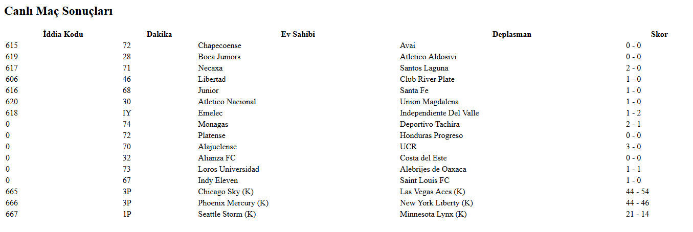

Bugün sizinle Php Mackolik Apisini kullanarak Mackolik Canlı Sonuçları çekeceğiz.

<!--more-->

 

## Kullanım

Çekmek istediğiniz maçları tarih(dd/mm/yyyy) get değişkeniyle canli.php dosyasında çekebilirsiniz.

## Örnek

Örnek olarak 19/08/2019 tarihinde 00:30 civarlarında başlayan maçların canlı skorlarını çekelim.

**Örnek Link**

```
siteadresi.com/canli.php?tarih=19/08/2019
```

**Örnek Çıktı:**

[](https://raw.githubusercontent.com/EmreKara5aya/Php-Mackolik-Api/master/canli.PNG)

## Bağış

Bitcoin : 1FBLrjGWye1CjDCgz4486KvkZ2uKNzzqta

## Dosyaları İndir

**[Github](https://github.com/EmreKara5aya/Php-Mackolik-Api)**

Hayırlı Günler.
