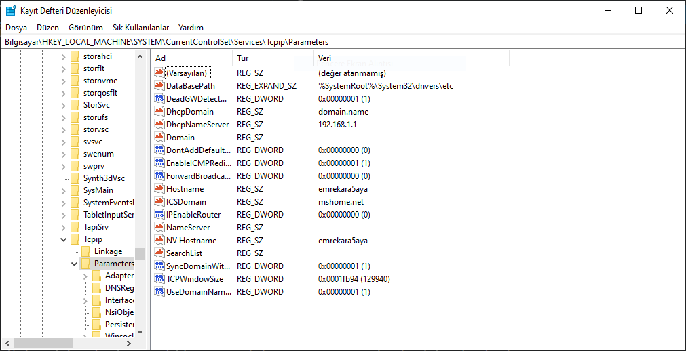
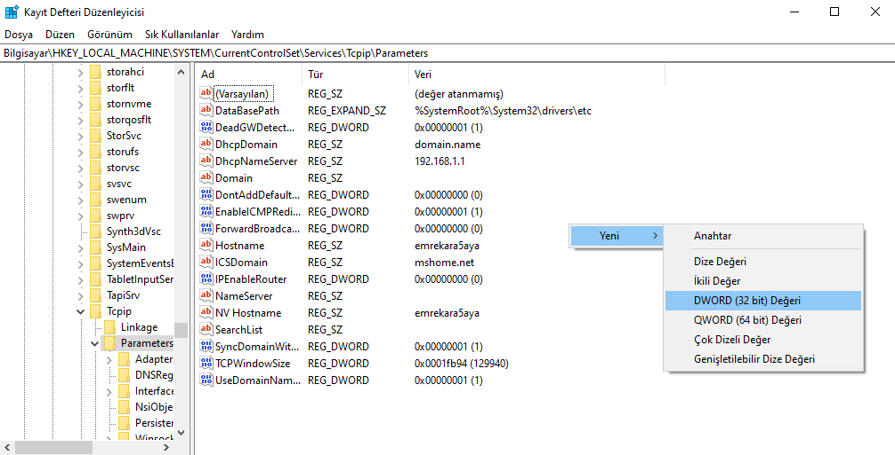
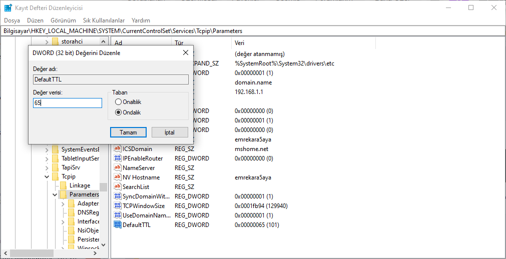
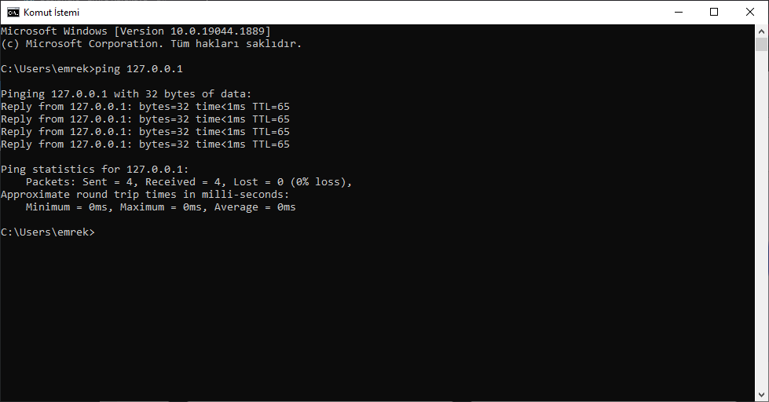
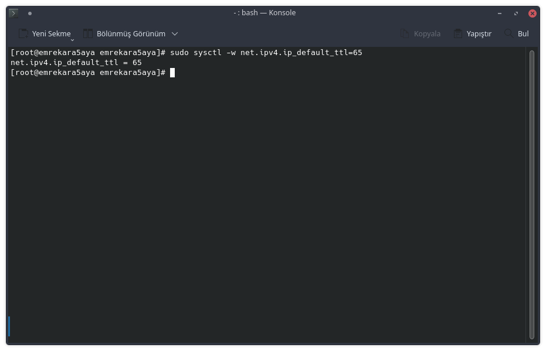
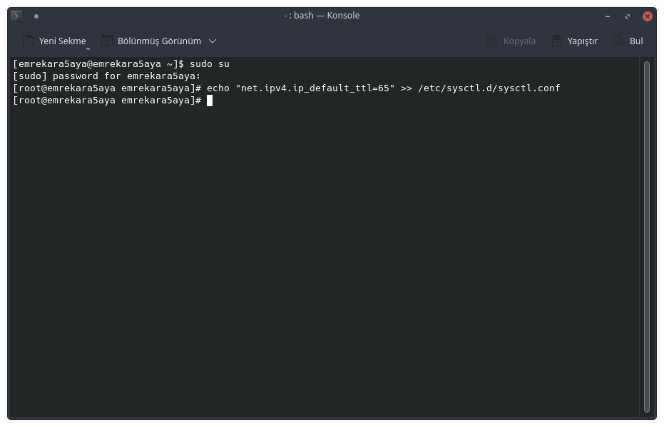
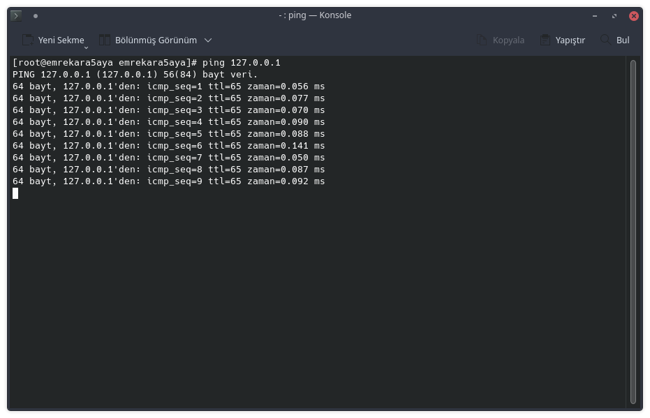

Bugün sizinle mobil operatörlerinin koyduğu Hotspot sınırını aşacağız.

<!--more-->

## Hotspot Nedir?

Hotspot insanların bir İnternet servis sağlayıcısına bağlı bir yönlendirici kullanarak kablosuz yerel alan ağı (WLAN) aracılığıyla , genellikle Wi-Fi teknolojisini kullanarak İnternet erişimi alabilecekleri fiziksel bir konumdur. Daha basit bir tanımıyla kullanıcıların internete bağlı bir cihazı yönlendirici olarak kullanarak diğer cihazlara kablosuz yerel alan ağı ile interneti paylaşmasıdır.

## Tethering Nedir?

Tethering  bir cihazın internetinin diğer cihazlara paylaştırılmasıdır. Tethering aynı Hotspot gibi Wi-Fi teknolojisini kullanarak interneti paylaşabildiği gibi Bluetooth ve USB üzerinden de paylaşabilmektedir.

## Hotspot Ve Tethering Arasındaki Fark Nedir?

Hotspot ve Tethering arasındaki farkı anlamak için ilk olarak yukarıdaki tanımlarını okumanız lazım. Hotspot sadece Wi-Fi teknolojisini kullaranak cihazları internet erişimi vermek için kullanılırken Tethering Wi-Fi teknolojisine ek olarak Bluetooh ve USB teknolojileri üzerinden de bağlantı yapabilmektedir.

## Hotspot Sınırı Nedir?

Hotspot sınırı mobil operatörler tarafından satılan tarifelerde internet paylaşımlarına konulmuş sınırdır. Günümüzde mobil operatörler TTL değerlerini inceleyerek internet paylaşımını yaptığımızı fark ederek paylaştığımız interneti bu sınırdan düşürmektedir.

## TTL Nedir?

Time to live (TTL) cihazdaki veya internetteki verinin ne kadar süre geçerli kalacağını belirleyen zaman damgasıdır. Genellikle saniye cinsinden belirlenir. Belirlenen saniye geçtikten sonra veri geçersiz olur. Bu sayede cihaz ve internet üzerinde sonsuz geçerli veriler engellenmiş olur.

## Hotspot Kullandığımız Nasıl Anlaşılır?

Mobil operatörler Hotspot kullandığımızı anlamak için ağımızdaki TTL değerlerini inceler. Örneğin kullandığımız mobil cihazlarda TTL değeri 64 'tür. Mobil operatörler sizin ağ üzerinizdeki verilerinizi inceleyerek TTL değeri 64 olmayan verileri ayıklar. Ayıklanan bu veriler toplanarak sizin Hotspot paketinizden düşürülür.

## Hotspot Sınırı Nasıl Aşılır?

Mobil operatörlerinin Hotspot kullandığımızı anlamamaları için Hotspot ağımıza bağlı olan cihazların operatörlere TTL değeri 64 olan veriler ulaşmalıdır. Bu yüzden Hotspot ağımıza bağlı olan cihazlarımızın TTL değerlerini 65 yapmalıyızdır. Bunun nedeni telefonumuzun Hotspot ağı üzerinde bir düğüm olduğu için ağ üzerinde geçen verilerin 1 adet TTL değerini telefonda bırakarak mobil operatörlere TTL değeri 64 olarak ulaşır. Mobil operatörler bu yüzden Hotspot ağımız üzerinden gelen veriyi mobil cihazımızdan gelmiş olarak gördükleri için veriyi Hotspot paketimizden düşmezler.

Kısaca biz Hotspot ağımızda herhangi bir sınıra takılmamak için ağımıza bağlı olan cihazlarının TTL değerlerini 65 olarak düzenleyeceğiz.

## TTL Değeri Nasıl Değiştirilir?

### Windows TTL Değeri Nasıl Değiştirilir?

Windows kullanan bilgisayarlarımızda TTL değerini değiştirmek için;

1. İlk olarak Kayıt Defteri Düzenleyicisine girmemiz gerekmektedir. Bunun için Başlat menüsüne veya Çalıştır bölümüne regedit yazarak Kayıt defteri Düzenliyicisine girelim.
2. Kayıt Defteri Düzenlicisinde`HKEY_LOCAL_MACHINE\SYSTEM\CurrentControlSet\Services\Tcpip\Parameters`yolunu izleyiniz. 
3. 32 bit Windows kullanıyorsanız sağ bölmedeki bölüme sağ tıklayarak Yeni -> DWORD (32-bit) Değeri 'ni seçin. Eğer 64 bit Windows kullanıyorsanız sağ bölmedeki bölüme sağ tıklayarak Yeni -> QWORD (64-bit) Değeri 'ni seçin. 
4. Oluşturduğunuz parametrenin adını DefaultTTL olarak değiştirin.
5. Oluşturduğunuz parametreye çift tıklarak ondalık sayı sistemini seçerek değerini 65 olarak ayarlayınız. 
6. Yukarıdaki adımları yaptıktan sonra bilgisayarınızı yeniden başlatarak adımları tamamlayabilirsiniz.

Yukarıdaki adımlar sonrasında bilgisayarınızın TTL değeri 65 olarak gözükmeye başlıyacaktır. Bunu kontrol etmek için komut penceresini açarak aşağıdaki kodu giriniz.

`ping 127.0.0.1`

Yukarıdaki kodu girdikten sonra resimdeki gibi TTL değeriniz 65 olarak gözükmeye başlıyacaktır. 

Eğer TTL değeriniz 65 olarak gözükmediyse adımları tekrar edebilirsiniz. Sorununuz adımları tekrar etmenize rağmen çözülmediyse kullandığınız Windows sürümünüzü belirterek yorumlardan destek alabilirsiniz.

### Linux TTL Değeri Değiştirme

1. Kullandığınız Linux dağıtımında konsolu açınız.
2. Açılan konsol ekranında `sudo sysctl -w net.ipv4.ip_default_ttl=65` kodunu yazıp ENTER tuşu ile onaylayınız. 

Girdiğiniz kod sayesinde oturumunuz açık olduğu süreç içerisinde TTL değeriniz 65 olarak ayarlanmış olacaktır. Eğer TTL değerini sürekli 65 yapmak istiyorsanız;

1. Kullandığınız Linux dağıtımında konsolu açınız.
2. Açılan konsol ekranında `sudo su echo "net.ipv4.ip_default_ttl=65" >> /etc/sysctl.d/sysctl.conf` kodunu yazarak ENTER tuşu ile onaylayınız. 
3. Eğer No such file or directory (Böyle bir dosya ya da dizin yok) hatasını alıyorsanız konsola `sudo su touch /etc/sysctl.d/net.conf echo "net.ipv4.ip_default_ttl=65" >> /etc/sysctl.d/net.conf` kodunu yazarak ENTER tuşu ile onaylayınız.
4. Tüm bu işlemlerden sonra bilgisayarınızı yeniden başlatın.

Yukarıdaki adımları doğru şekilde uyguladığınız zaman Linux dağıtımınızda TTL değeri 65 olacaktır. Linux dağıtımınızda TTL değerini kontrol etmek için `ping 127.0.0.1` kodunu kullanabilirsiniz. Kodu girdikten sonra resimdeki gibi TTL değeriniz 65 olarak gözükmeye başlıyacaktır.  Eğer TTL değeriniz 65 olarak gözükmediyse adımları tekrar edebilirsiniz. Sorununuz adımları tekrar etmenize rağmen çözülmediyse kullandığınız Linux dağıtımınızı belirterek yorumlardan destek alabilirsiniz.

## Sonuç

Bu yazımda size mobil operatörlerin koyduğu Hotspot sınırını nasıl aşacağınızı anlatmaya çalıştım. Anlamadığınız yerleri ve sorularınızı yorum olarak sorabilirsiniz.

Hayırlı Günler.
