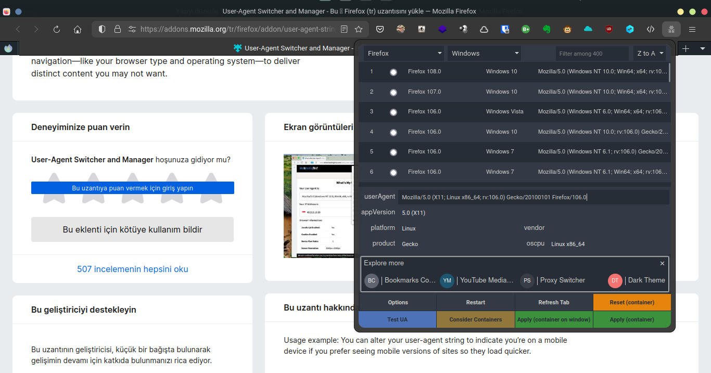
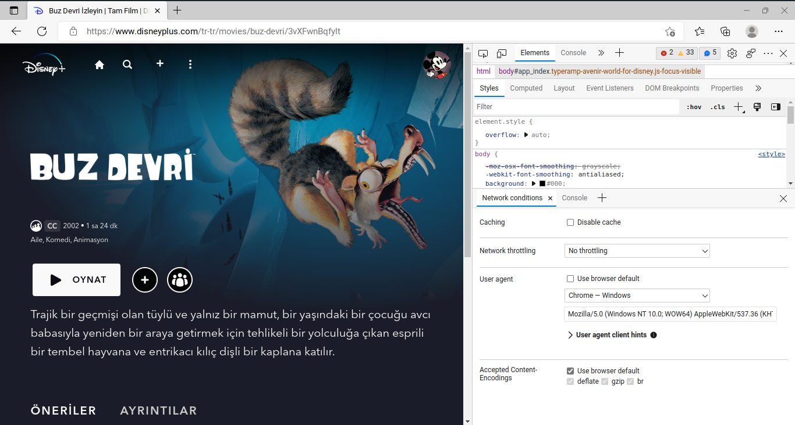
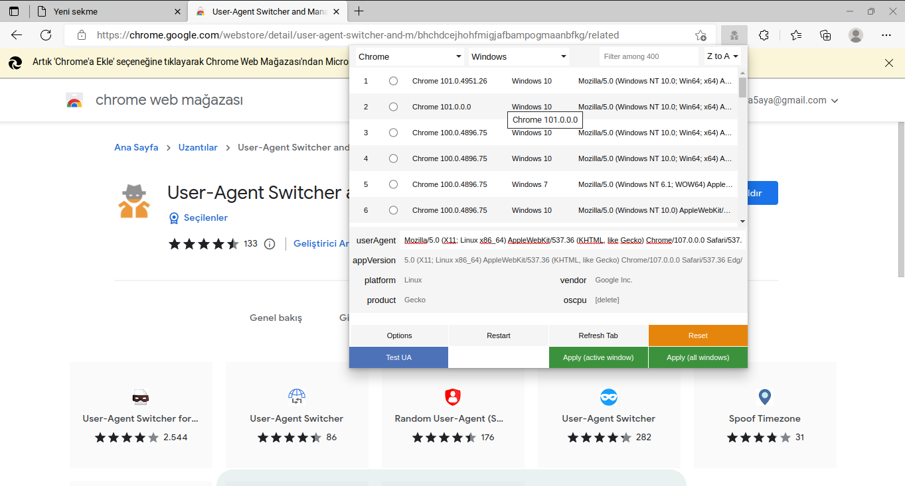

Geçtiğimiz günlerde aniden Linux işletim sistemlerinde çalışmayı bırakan Disney Plus video servisini sorunsuz bir şekilde izleme yöntemlerini inceleyeceğiz. <!--more-->

Geçtiğimiz aylarda ülkemizde hizmet vermeye başlayan Disney Plus da kullanıcılar daha önceden Linux uygulaması olmaması rağmen tarayıcılar üzerinden kısıtlama olmadan Disney Plus üzerinden filmler izleyebiliyordu.

Ancak geçtiğimiz hafta ile Linux işletim sistemi üzerinden Disney Plus filmlerini izlemeye çalışan kullanıcılar boş ekran hatası almaya başladılar. Tabi ki kullanıcıların hatanın Disney firmasının koyduğu bir yasaktan kaynaklandığını ve yasağı user agent değiştirerek geçebileceklerini keşfetmesi uzun sürmedi. Bizde bugün Linux işletim sisteminde sorunsuz bir şekilde Disney Plus filmlerini izleyebilmemiz için popüler 2 tarayıcı da user agent değişimi yapacağız.

## Firefox Tarayıcısında User Agent Değiştirmek

1. Firefox tarayısından User Agent değiştirmek için [User-Agent Switcher and Manager](https://addons.mozilla.org/tr/firefox/addon/user-agent-string-switcher/) eklentisini kuracağız. Eklentiye ulaşmak için eklenti adına veya [buraya tıklayarak](https://addons.mozilla.org/tr/firefox/addon/user-agent-string-switcher/) ulaşabilirsiniz.
2. Eklenti sayfasında Firefox'a ekle butonuna tıklayarak eklentiyi tarayıcısına kurabilirsiniz. Eklenti tarayıcınıza kurulduktan sonra resimde görüldüğü gibi tarayıcınızın sol üst bölümünde gözükmeye başlıyacaktır.
3. Eklentiyi açarak işletim sistemi bölümünden Windows işletim sistemini seçin. Tarayıcı seçiminiz Firefox veya Chrome olabilir.
4. İşletim sistemi ve Tarayıcı seçiminizi yaptıktan sonra listelenen user agent kayıtlarından birini seçin ve alt bölümde bulunan yeşil renkli Apply (Container) butonuna tıklayın.

Eğer anlatıma uygun bir şekilde eklentiyi aktif ettiyseniz Linux işletim sisteminde Firefox tarayıcısı üzerinden sorunsuz bir şekilde Disney Plus filmlerini izlemeye başlayabilirsiniz.

## Chrome - Chromium Tarayıcılarında User Agent Değiştirmek

### Eklentisiz Yolla

1. Chrome - Chromium tarayıcılarında User Agent değiştirmek için CTRL + SHIFT + J tuşlarına aynı anda basarak Geliştirici Konsolunu açmanız gerekmektedir.
2. Geliştirici konsolunuz açıldıktan sonra CTRL + SHIFT + P tuşlarına aynı anda basarak Network Conditions yazarak Network Conditions ayarlarını açınız.
3. Network Conditions ayarları açıldıktan sonra User agent bölümünden Use Browser Default bölümündeki işareti kaldırın.
4. İşareti kaldırdıktan sonra Custom yazan menüye tıklayarak Chrome Windows seçeneğini seçiniz.
5. Adımları doğru bir şekilde yaptıysanız resimdeki gibi tarayıcınızda Chrome Windows user agent kaydı seçilmiş olmalıdır.Eğer herhangi bir hata göremiyorsanız sayfayı yeniden yükleyerek Linux işletim sisteminde Chrome - Chromium tarayıcınız üzerinden sorunsuz bir şekilde Disney Plus filminizi izlemeye başlayabilirsiniz.

### Eklentili Yolla

1. Chrome - Chromium tarayıcılarında User Agent değiştirmek için [User-Agent Switcher and Manager](https://chrome.google.com/webstore/detail/user-agent-switcher-and-m/bhchdcejhohfmigjafbampogmaanbfkg) eklentisini kuracağız. Eklentiye ulaşmak için eklenti adına veya [buraya tıklayarak](https://chrome.google.com/webstore/detail/user-agent-switcher-and-m/bhchdcejhohfmigjafbampogmaanbfkg) ulaşabilirsiniz.
2. Eklenti sayfasında Chrome’a ekle butonuna tıklayarak eklentiyi tarayıcısına kurabilirsiniz. Eklenti tarayıcınıza kurulduktan sonra resimde görüldüğü gibi tarayıcınızın sol üst bölümünde gözükmeye başlıyacaktır. Ancak bazı durumlarda Uzantılar menüsünde de gözükebilir.
3. Eklentiyi açarak işletim sistemi bölümünden Windows işletim sistemini seçin. Tarayıcı seçiminiz Firefox veya Chrome olabilir.
4. İşletim sistemi ve Tarayıcı seçiminizi yaptıktan sonra listelenen user agent kayıtlarından birini seçin ve alt bölümde bulunan yeşil renkli Apply (Container) butonuna tıklayın.

Eğer anlatıma uygun bir şekilde eklentiyi aktif ettiyseniz Linux işletim sisteminde Chrome - Chromium tarayıcınız üzerinden sorunsuz bir şekilde Disney Plus filmlerini izlemeye başlayabilirsiniz.

## Sonuç

Bu yazımda size Disney Plus 'un koyduğu saçma Linux yasağını nasıl aşacağınızı anlatmaya çalıştım. Anlamadığınız yerleri ve sorularınızı yorum olarak sorabilirsiniz.

Hayırlı Günler.
